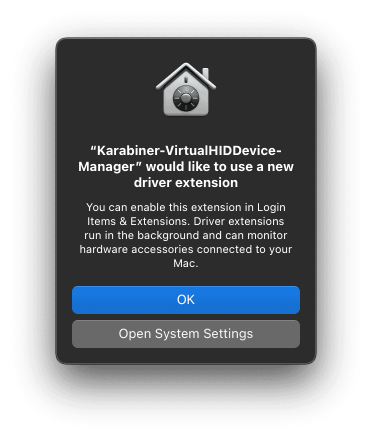

# kanata-darwin

Declarative [nix-darwin](https://github.com/LnL7/nix-darwin) module for [kanata](https://github.com/jtroo/kanata) keyboard remapper on macOS.

Handles everything needed to run kanata on macOS:
- Installs and activates the [Karabiner DriverKit VirtualHIDDevice](https://github.com/pqrs-org/Karabiner-DriverKit-VirtualHIDDevice) (required for HID on macOS)
- Configures launchd services, sudoers, and TCC permissions
- Optionally integrates [kanata-tray](https://github.com/rszyma/kanata-tray) GUI with a macOS .app bundle

## Usage

Add to your flake inputs:

```nix
{
  inputs = {
    kanata-darwin = {
      url = "github:not-in-stock/kanata-darwin";
      inputs.nixpkgs.follows = "nixpkgs";
    };
  };
}
```

Include the module in your darwin configuration:

```nix
modules = [
  inputs.kanata-darwin.darwinModules.default
  # ...
];
```

Minimal configuration:

```nix
services.kanata = {
  enable = true;
  configSource = ./kanata.kbd;  # symlinked to configFile path
};
```

## Options

All options are under `services.kanata`.

| Option | Type | Default | Description |
|---|---|---|---|
| `enable` | bool | `false` | Enable kanata with Karabiner DriverKit |
| `mode` | `"daemon"` \| `"tray"` | `"tray"` | Launch mode (see below) |
| `sudoers` | bool | `true` | Add NOPASSWD sudoers entry |
| `user` | string | `system.primaryUser` | Username for file paths, sudoers, and user agents |
| `configFile` | string | `~/.config/kanata/kanata.kbd` | Path to kanata config |
| `configSource` | path \| string \| null | `null` | If set, `configFile` is symlinked to this path; use a string for an out-of-store symlink |
| `package` | package | `pkgs.kanata-with-cmd` | The kanata package |
| `tray.package` | package | from kanata-tray flake | The kanata-tray package |
| `tray.autostart` | bool | `true` | Create a launchd agent to start kanata-tray at login |
| `tray.icons.labels` | attrsOf string | `{}` | Map of layer names to text labels or font glyphs; generates menu bar icons |
| `tray.icons.font` | package | `pkgs.liberation_ttf` | Font package for generated icons (e.g. Nerd Fonts) |
| `tray.icons.files` | attrsOf path | `{}` | Custom icon files (override generated for same layer) |
| `tray.settings` | TOML attrs | `{}` | Extra settings merged into `kanata-tray.toml` |

## Modes

The `mode` and `sudoers` options combine into four configurations:

| mode | sudoers | How it works |
|---|---|---|
| `tray` | `true` (default) | kanata-tray launches kanata via sudo NOPASSWD — no prompts |
| `tray` | `false` | Prompts for TouchID/password on start; password dialog on stop |
| `daemon` | `true` (default) | Headless user launchd agent via sudo NOPASSWD; one-time TCC dialog |
| `daemon` | `false` | Root launchd daemon with TCC sqlite3 hack (fragile, not recommended) |

> [!CAUTION]
> `daemon` + `sudoers = false` uses a sqlite3 hack to write directly to the macOS TCC database for Input Monitoring permission. Apple may change the TCC.db schema in future macOS updates, which would silently break kanata or corrupt the database. Prefer `sudoers = true` (default) or `mode = "tray"` instead.

## First activation

On the first `darwin-rebuild switch`, macOS will show a system dialog asking to allow the Karabiner DriverKit extension:

<p align="center">
  
</p>

Click **"Open System Settings"** to navigate to the driver extension activation page. Do not click "OK" - it will dismiss the dialog without activating the extension.

## Layer icons

The module can generate menu bar icons for kanata-tray from text labels. Icons are rendered as white rounded rectangles with the label cut out (transparent). Each glyph is automatically scaled to fill the icon area.

Simple letters:

```nix
services.kanata.tray.icons.labels = {
  default = "K";
  nav = "N";
};
```

Glyphs - use the `U+XXXX` codepoint syntax so labels stay readable in any editor:

```nix
services.kanata.tray.icons = {
  font = pkgs.nerd-fonts.sauce-code-pro;
  labels = {
    default = "U+F0B34"; # nf-md-format_letter_case (Aa)
    nav = "U+F062";      # nf-fa-arrow_up
    sym = "U+EA8B";      # nf-cod-symbol_namespace ({})
    num = "U+F03A0";     # nf-md-numeric (123)
    fun = "U+F0295";     # nf-md-function (ƒ)
  };
};
```

Labels matching `U+XXXX` are automatically converted to the corresponding Unicode character during icon generation.

You can also provide pre-made icon files via `tray.icons.files`, which take priority over generated ones for the same layer name.

## Tips

In tray mode without `sudoers`, kanata prompts for a password on each start. To use TouchID instead:

```nix
security.pam.services.sudo_local.touchIdAuth = true;
```

## Karabiner driver

The module automatically installs the Karabiner DriverKit VirtualHIDDevice package and starts its daemon via launchd. The driver pkg is installed outside the Nix store because macOS rejects code signatures from store paths.
