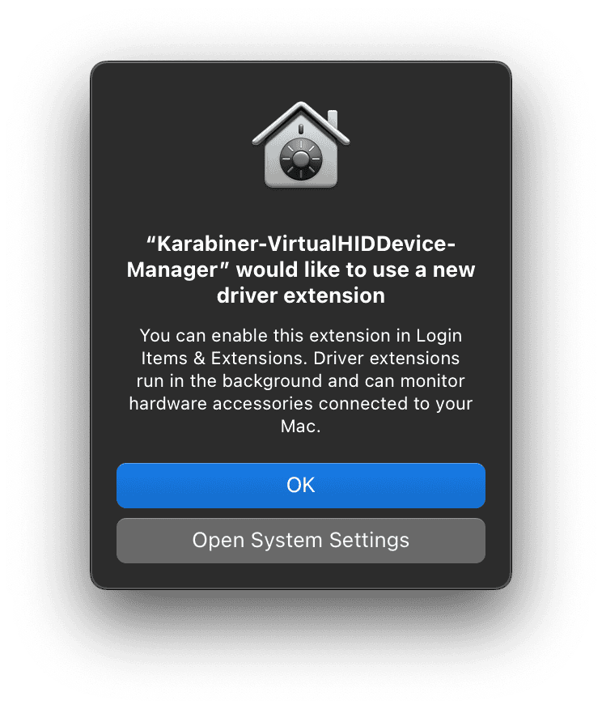

# kanata-darwin

Declarative [nix-darwin](https://github.com/LnL7/nix-darwin) module for [kanata](https://github.com/jtroo/kanata) keyboard remapper on macOS.

Handles everything needed to run kanata on macOS:
- Installs and activates the [Karabiner DriverKit VirtualHIDDevice](https://github.com/pqrs-org/Karabiner-DriverKit-VirtualHIDDevice) (required for HID on macOS)
- Configures launchd services, sudoers, and TCC permissions
- Optionally integrates [kanata-bar](https://github.com/not-in-stock/kanata-bar) or [kanata-tray](https://github.com/rszyma/kanata-tray) GUI launchers

## Usage

Add to your flake inputs:

```nix
{
  inputs = {
    kanata-darwin = {
      url = "github:not-in-stock/kanata-darwin";
      inputs.nixpkgs.follows = "nixpkgs";
    };
  };
}
```

Include the module in your darwin configuration:

```nix
modules = [
  inputs.kanata-darwin.darwinModules.default
  # ...
];
```

Minimal configuration (manual mode — kanata in PATH, start manually):

```nix
services.kanata = {
  enable = true;
  configSource = ./kanata.kbd;
};
```

## Launch modes

The module provides three launch submodules. Enable at most one (or none for manual mode):

### kanata-bar (recommended)

Native macOS menu bar app with TouchID support, layer icons, and auto-restart:

```nix
services.kanata = {
  enable = true;
  configSource = ./kanata.kbd;
  sudoers = false;  # kanata-bar handles privilege escalation via TouchID

  kanata-bar = {
    enable = true;
    settings.kanata_bar.pam_touchid = "auto";
    settings.kanata_bar.autorestart_kanata = true;
    icons = inputs.kanata-darwin.lib.mkLayerIcons pkgs {
      font = pkgs.nerd-fonts.sauce-code-pro;
      labels = {
        default = "U+F0B34";
        nav = "U+F062";
      };
    };
  };
};
```

### kanata-tray

Cross-platform tray app:

```nix
services.kanata = {
  enable = true;
  configSource = ./kanata.kbd;

  kanata-tray = {
    enable = true;
    icons = inputs.kanata-darwin.lib.mkLayerIcons pkgs {
      font = pkgs.nerd-fonts.sauce-code-pro;
      labels = { default = "K"; nav = "N"; };
    };
  };
};
```

### daemon

Headless launchd service:

```nix
services.kanata = {
  enable = true;
  configSource = ./kanata.kbd;
  daemon.enable = true;
};
```

## Options

All options are under `services.kanata`.

### Top-level

| Option | Type | Default | Description |
|---|---|---|---|
| `enable` | bool | `false` | Enable kanata with Karabiner DriverKit |
| `sudoers` | bool | `true` | Add NOPASSWD sudoers entry |
| `user` | string | `system.primaryUser` | Username for file paths, sudoers, and user agents |
| `configFile` | string | `~/.config/kanata/kanata.kbd` | Path to kanata config |
| `configSource` | path \| string \| null | `null` | If set, `configFile` is symlinked to this path |
| `package` | package | `pkgs.kanata-with-cmd` | The kanata package |

### daemon

| Option | Type | Default | Description |
|---|---|---|---|
| `daemon.enable` | bool | `false` | Enable headless launchd service |
| `daemon.extraLaunchdConfig` | attrs | `{}` | Extra launchd plist attributes (e.g. `ThrottleInterval`, `KeepAlive`) |

### kanata-tray

| Option | Type | Default | Description |
|---|---|---|---|
| `kanata-tray.enable` | bool | `false` | Enable kanata-tray GUI launcher |
| `kanata-tray.package` | package | from kanata-tray flake | The kanata-tray package |
| `kanata-tray.autostart` | bool | `true` | Create launchd agent for auto-start at login |
| `kanata-tray.smapp` | bool | `true` | Use SMAppService for Login Items integration (proper icon in System Settings) |
| `kanata-tray.extraLaunchdConfig` | attrs | `{}` | Extra launchd plist attributes, applied in both smapp and legacy modes |
| `kanata-tray.icons` | attrsOf path | `{}` | Layer icon files (use `mkLayerIcons` to generate) |
| `kanata-tray.settings` | TOML attrs | `{}` | Extra settings merged into `kanata-tray.toml` |

### kanata-bar

| Option | Type | Default | Description |
|---|---|---|---|
| `kanata-bar.enable` | bool | `false` | Enable kanata-bar GUI launcher |
| `kanata-bar.package` | package | fetched from GitHub Releases | The kanata-bar .app package |
| `kanata-bar.autostart` | bool | `true` | Create launchd agent for auto-start at login |
| `kanata-bar.smapp` | bool | `true` | Use SMAppService for Login Items integration (proper icon in System Settings) |
| `kanata-bar.extraLaunchdConfig` | attrs | `{}` | Extra launchd plist attributes, applied in both smapp and legacy modes |
| `kanata-bar.settings` | TOML attrs | `{}` | Settings merged into `config.toml` |
| `kanata-bar.icons` | attrsOf path | `{}` | Layer icon files (use `mkLayerIcons` to generate) |

## Privilege escalation

| Mode | sudoers | How it works |
|---|---|---|
| `kanata-bar` | `false` (recommended) | kanata-bar handles privilege escalation via TouchID/password (pam_touchid) |
| `kanata-bar` | `true` | kanata-bar uses sudo NOPASSWD for kanata |
| `kanata-tray` | `true` (recommended) | kanata-tray launches kanata via sudo NOPASSWD wrapper |
| `kanata-tray` | `false` | Prompts for TouchID/password on start; password dialog on stop |
| `daemon` | `true` (default) | Headless user launchd agent via sudo NOPASSWD; one-time TCC dialog |
| `daemon` | `false` | Root launchd daemon with TCC sqlite3 hack (fragile, not recommended) |

> [!CAUTION]
> `daemon` + `sudoers = false` uses a sqlite3 hack to write directly to the macOS TCC database for Input Monitoring permission. Apple may change the TCC.db schema in future macOS updates, which would silently break kanata or corrupt the database. Prefer `sudoers = true` or use kanata-bar/kanata-tray instead.

## Layer icons

Use `mkLayerIcons` to generate menu bar icons from font glyphs. The function is exported as `lib.mkLayerIcons` from the flake and works with both kanata-bar and kanata-tray:

```nix
let
  icons = inputs.kanata-darwin.lib.mkLayerIcons pkgs {
    font = pkgs.nerd-fonts.sauce-code-pro;
    labels = {
      default = "U+F0B34"; # nf-md-format_letter_case (Aa)
      nav = "U+F062";      # nf-fa-arrow_up
      sym = "U+EA8B";      # nf-cod-symbol_namespace ({})
      num = "U+F03A0";     # nf-md-numeric (123)
      fun = "U+F0295";     # nf-md-function (f)
    };
  };
in {
  services.kanata.kanata-bar.icons = icons;
  # or
  services.kanata.kanata-tray.icons = icons;
}
```

Icons are rendered as white rounded rectangles with the label cut out (transparent), adapting to light/dark mode. Labels matching `U+XXXX` are converted to the corresponding Unicode character.

You can also provide pre-made icon files directly:

```nix
services.kanata.kanata-bar.icons = {
  nav = ./icons/nav.png;
  sym = ./icons/sym.png;
};
```

## First activation

On the first `darwin-rebuild switch`, macOS will show a system dialog asking to allow the Karabiner DriverKit extension:

<p align="center">
  
</p>

Click **"Open System Settings"** to navigate to the driver extension activation page. Do not click "OK" - it will dismiss the dialog without activating the extension.

## Troubleshooting

### Input Monitoring permission not requested

If kanata-bar or kanata-tray doesn't prompt for Input Monitoring after a fresh install, a stale TCC entry from a previous installation (e.g. Homebrew cask) may be blocking the dialog. macOS identifies apps by bundle identifier, so reinstalling via a different method reuses the old TCC record.

Reset the entry to trigger the permission dialog again:

```bash
tccutil reset ListenEvent com.kanata-bar
```

Or manually: **System Settings > Privacy & Security > Input Monitoring** — find Kanata Bar, remove it, then relaunch the app.

## Tips

In kanata-tray mode without `sudoers`, kanata prompts for a password on each start. To use TouchID instead:

```nix
security.pam.services.sudo_local.touchIdAuth = true;
```

## Karabiner driver

The module automatically installs the Karabiner DriverKit VirtualHIDDevice package and starts its daemon via launchd. The driver pkg is installed outside the Nix store because macOS rejects code signatures from store paths.
